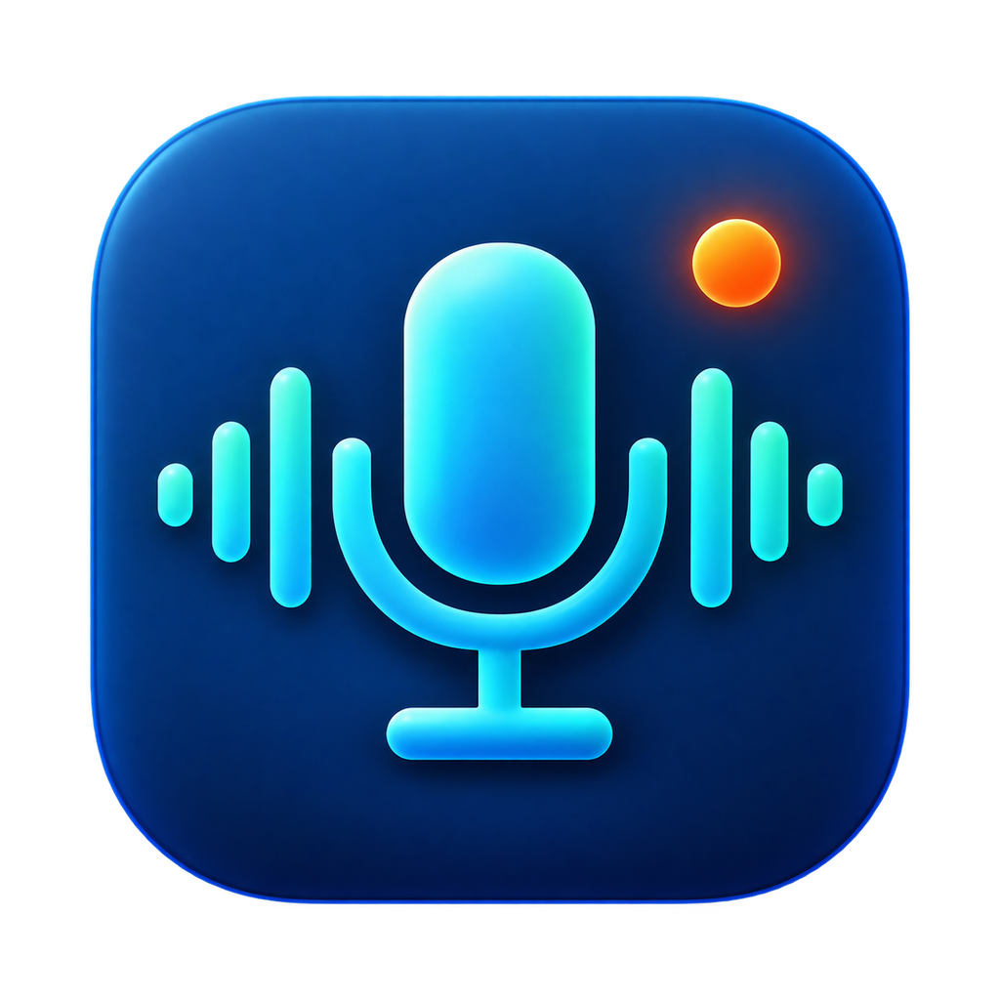

# SnipVoice

<p align="center">
  
</p>

<p align="center">
  A local-first voice dictation and meeting recorder for Windows and macOS,
  with separate microphone and system-audio tracks.
</p>

<p align="center">
  <a href="https://github.com/rteoo/snipvoice/actions/workflows/ci.yml"></a>
  <a href="https://github.com/rteoo/snipvoice/releases/tag/v3.3.2"></a>
  <a href="LICENSE"></a>
</p>

Hold a shortcut, speak, and release. SnipVoice transcribes with an installed
local model and inserts the result at the cursor target captured when recording
started. It can also record meetings from the microphone, speaker output, or
both, while keeping each source in its own recoverable track.

SnipVoice is the standalone voice companion extracted from
[Sniptype](https://github.com/rteoo/sniptype). It has separate settings, models,
recordings, shortcuts, process identity, and installers.

## Highlights

- Local push-to-talk dictation with configurable shortcuts and languages.
- Brazilian Portuguese (default) or US English interface, switchable in **Configurações > Geral > Idioma** without restarting.
- System-aware light and dark appearance, with explicit Light/Dark overrides.
- Separate microphone and selected speaker-output recording on Windows and macOS.
- Independent microphone/system toggles, live two-track waveforms, and OS-default or manually pinned endpoints.
- Crash-recoverable segmented audio, explicit gaps, pause/resume, and partial-session preservation.
- Atomic final MP3 recording with conservative microphone volume adjustment; WAV remains an export option.
- Meeting library with local search, playback, and transcription revisions.
- WAV, MP3, AAC/M4A, FLAC, OGG, and Opus import plus Markdown, text, JSON, and per-track WAV export.
- Configurable final-audio destination, automatic transcription and summaries with installed local models, and summary regeneration.
- Readable full-text transcripts by default, with a timestamped view and complete copy/export after recording.
- Installed-only meeting transcription; automatic processing never downloads a model.
- Cited summaries through a built-in llama.cpp runtime and downloadable local models.
- Deterministic term corrections and optional literal spoken commands.
- No telemetry, transcript logging, implicit cloud storage, or Sniptype data migration.

## Quick start

Download the package for your platform from the
[stable v3.3.2 release](https://github.com/rteoo/snipvoice/releases/tag/v3.3.2).
To run from source with Python installed:

```powershell
git clone https://github.com/rteoo/snipvoice.git
cd snipvoice\source
python -m pip install -r requirements.txt -r requirements-voice.txt
python snipvoice.pyw
```

Compressed audio import additionally requires SnipVoice's clean PyAV/FFmpeg
runtime. Build it using [`packaging/README.md`](packaging/README.md); official
release bundles already include it. Do not substitute PyAV's upstream binary
wheel when producing a SnipVoice release.

Use `pythonw snipvoice.pyw` on Windows after setup when you do not need console
output. Models are not bundled. Voice starts disabled until a model is selected
and the feature is enabled from **Configurar voz…**.

### Releases and installers

The current stable release is
[`v3.3.2`](https://github.com/rteoo/snipvoice/releases/tag/v3.3.2):

| Platform | Package |
| --- | --- |
| Windows x64 | Per-user installer and portable ZIP |
| macOS 14.4+ ARM64 | Ad-hoc-signed `.app` bundle in a ZIP |

The current recording-workflow beta is
[`v3.4.0-beta.3`](https://github.com/rteoo/snipvoice/releases/tag/v3.4.0-beta.3).
It applies the Win Design System to the manager, keeps recording controls reachable
at the minimum window size, simplifies the library's empty and filtered states,
and groups less-used dictation tools in a menu. These beta packages need real-device
recording feedback before a stable release.
This beta omits MSIX: beta 2 already used Store package version `3.4.0.0`,
and Store submissions require a higher version.

The packages are not notarized or publisher-signed. Windows SmartScreen and
macOS Gatekeeper may therefore require the standard manual confirmation on first
launch. The Windows installer uses no administrator rights and installs under
`%LOCALAPPDATA%\Programs\Snipvoice`. Application data stays outside the package.

### What's new in v3.3.2

- Whisper Small, Whisper Large v3 Turbo and Whisper Large v3 are available as optional local transcription models.
- The SnipVoice data folder and the downloaded-models folder can each be moved to another location, including a models folder shared with other apps.
- Configurações groups transcription and summary model downloads under Modelos, and download buttons stand out clearly on their cards.

## First use

1. Start SnipVoice and find its icon in the Windows tray or macOS menu bar.
2. Open **Configurar voz…**. The SnipVoice window keeps voice setup, recording, the meeting library, and summary models in separate tabs.
3. In **Ditado**, choose a profile and language, then download or import its local model.
4. Enable voice input, hold `ctrl+alt+space`, speak, and release to transcribe.
5. Use **Gravação** to choose microphone/system sources and record a meeting. The **Abrir Gravação…** tray shortcut selects this tab in the same window.
6. Open **Configurações** to follow the system appearance or choose a fixed light or dark theme. Under **Geral > Idioma**, choose **English (US)** to switch the interface to English; the tabs then read Recording, Library, Dictation, and Settings.
7. In the same tab, choose Qwen3.5 0.8B/2B/4B, LiquidAI LFM2.5, or Gemma 4 E2B/E4B, and download the model before generating a summary.

Escape cancels active dictation. A failed or interrupted utterance remains in
voice history and can be retried manually without a delayed blind paste.
The compact non-activating indicator stays dark in every theme so recording,
local transcription, and text insertion remain easy to spot without taking
focus from the target application.

## Dictation and commands

The default dictation shortcut is `ctrl+alt+space`. SnipVoice captures the target
before opening the microphone, keeps capture and inference off the keyboard
listener, and restores the target only after transcription completes.

Optional spoken commands use `ctrl+alt+shift+space`. Create a private
`commands.json` under the SnipVoice data directory, for example:

```json
{"hello": "Hello, how can I help?"}
```

In **Ditado**, use **Recarregar comandos**, then hold the command shortcut and say the exact
trigger. Values are inserted literally. Sniptype libraries and dynamic actions
are deliberately not imported.

## Meetings

The **Gravação**, **Biblioteca**, **Ditado**, and **Configurações** tabs keep meeting
capture independent from dictation inside the main SnipVoice window. Recording
works when dictation is disabled and before any model is installed.

| Capability | Behavior |
| --- | --- |
| Sources | Independently toggle microphone and speaker output; raw sources stay in separate native PCM tracks |
| Devices | Follow the OS multimedia/communications default or pin a stable endpoint |
| Recovery | Append-only 30-second segments, CRC journal, atomic metadata, interrupted-session repair |
| Workspace | Live source waveforms, pause/resume, meters, title, local search, full-text and timestamped review |
| Playback | Seek by timestamp and play one track through the current OS output |
| Processing | Automatic transcription and summary with installed local models, with durable revisions and summary regeneration |
| Files | Timestamp-aligned MP3 recordings, optional PCM16 WAV export, bounded WAV/MP3/AAC/M4A/FLAC/OGG/Opus import, and text/JSON/per-track exports |

Selecting an output captures the mix already routed to that device; SnipVoice
does not move another application's audio. Source labels identify tracks, not
individual speakers. Acoustic echo cancellation and diarization are not included.

The optional microphone volume adjustment measures the recording and applies bounded
gain and a limiter to the derived final audio without gating quiet speech. Raw source tracks remain unchanged; it is not
a spectral denoiser or acoustic echo canceller.

### Meeting memory: local data model and status

Meeting memory is built around a canonical bundle plus a disposable catalog.
The bundle remains authoritative; SQLite/FTS5 is a rebuildable projection used
for listing and search. Capture never depends on SQLite, the GUI, or a model.

```text
SNIPVOICE_HOME/
├── workspace.json          # profiles, collections, series, privacy defaults
├── library.sqlite          # disposable plaintext search/listing projection
├── retention-ops/          # recoverable retention journals and staging
├── trash/                  # recoverable whole-meeting trash
└── meetings/<session-id>/
    ├── metadata.json       # capture/recovery authority
    ├── annotations.json    # human-owned notes and revision-scoped edits
    ├── events.journal      # audio provenance and recovery journal
    ├── microphone/         # native PCM segments
    ├── system/             # native PCM segments
    ├── transcripts/        # immutable JSONL revisions
    └── reports/            # immutable generated report envelopes
```

The current implementation includes the complete local meeting-memory slice:
report profiles and immutable cited reports, reviewable post-meeting artifacts,
revision-scoped transcript labels/highlights and source clips, single- and
cross-meeting Q&A, collections/tags/people/series, SQLite/FTS5 search and
rebuild, exports, configurable recording consent/privacy, and recoverable
retention with trash, restore, and explicit raw-track/permanent purge. The
controller, GUI, meeting hotkey, and tray routes are wired to these operations.
Physical Tk/tray interaction, native capture, packaged startup, and signing
remain unverified on this host.

The catalog contains sensitive plaintext copied from transcripts, notes, and
reports. Treat `library.sqlite`, its `-wal`/`-shm` sidecars, backups, logs, and
trash as private meeting data. Deleting the catalog loses only the projection;
rebuilding it must not be treated as a deletion mechanism for canonical data.

## Local transcription and summaries

Model downloads happen only after an explicit action in voice settings. Meeting
processing accepts installed catalog models and never downloads one implicitly.
Recordings remain usable before transcription and preserve earlier revisions.

Structured summaries run inside SnipVoice through llama.cpp. Qwen3.5 0.8B is
the 503 MiB compute-budget option for constrained hardware, while Qwen3.5 2B
Q4_K_M remains the recommended default and Qwen3.5 4B favors quality. LiquidAI
LFM2.5-2.6B is the efficient alternative, and Gemma 4 E2B/E4B are Google's
current options.
Gemma E2B is 3.12 GiB; the higher-capacity E4B is 4.80 GiB and contains about 8B
total parameters. The **Configurações** tab shows the effective and total counts before download.
LiquidAI uses the LFM Open License v1.0 rather than MIT or Apache-2.0. Its first
download shows the license terms and the US$10 million annual-revenue commercial
use threshold for explicit acceptance.
Downloads use a fixed catalog, stream to a resumable partial
file, and become usable only after their exact size and SHA-256 match.
After a model is installed, summary inference makes no network request. Review
cited decisions and action items before using them.

## Data safety and privacy

Settings, optional commands, logs, voice history, raw meetings, and the default
final-recording folder live under
`~/.snipvoice` by default. **Configurações > Geral > Pasta de dados** moves
that whole folder to another location (for example `D:\snipvoice`): SnipVoice
restarts, copies and verifies every file when the new folder is on another
drive, and only then deletes the old copy. The chosen location is recorded in
`location.json` under `%LOCALAPPDATA%\Snipvoice` (macOS:
`~/Library/Application Support/Snipvoice`; Linux: `~/.config/snipvoice`).
`SNIPVOICE_HOME` overrides both and disables the move controls.

Downloaded models live apart from the data folder, under
`%LOCALAPPDATA%\Snipvoice` by default (macOS: `~/Library/Caches/Snipvoice`;
Linux: `~/.cache/snipvoice`), as plain GGUF files in `voice-models\<model>\`
and `summary-models\<model>\`, each beside a `manifest.json`. Other
compatible apps can open those files directly. **Configurações > Modelos >
Pasta dos modelos** moves them to another folder with the same restart and
verified copy; that folder may be shared with other apps, and only the two
SnipVoice subfolders are written there. A model already present at the
destination is kept and the old copy is left in place. `SNIPVOICE_VOICE_CACHE`
and `SNIPVOICE_SUMMARY_CACHE` override the location per model type and disable
the move controls.

Inactive dictation audio and transcripts expire after 30 days, checked when the
voice controller starts. Set `voice_history_retention_days` in `settings.json`
to an integer from 1 to 3650 to change this period. Active, malformed, and
unrecognized entries are preserved. This applies to existing dictation history;
export anything you want to keep before upgrading. Meeting recordings remain
until the user removes them. Meeting retention operations require an explicit
preview and target resolution: whole meetings can move to recoverable trash,
and selected raw tracks can be staged for removal. Permanent purge requires a
separate confirmation and cannot be undone. External exports are not deleted by
these operations. Files and the SQLite index are plaintext; use OS disk
encryption and protect the user account. Deleting files on an SSD is not
forensic erasure. There is no telemetry, transcript logging, implicit upload,
or cloud fallback by default. Local inference uses installed models; model
acquisition remains an explicit settings action.
Do not commit or share live recordings, personal commands, settings, model
files, logs, backups, or the SQLite catalog. Playback is blocked during
recording so SnipVoice does not capture itself.

For the storage contract, backup/restore guidance, downgrade behavior, repair,
exports, and current validation limits, see
[`source/docs/local-meeting-memory-operations.md`](source/docs/local-meeting-memory-operations.md).

## Platform status and limitations

SnipVoice packages Windows x64 and Apple Silicon macOS 14.4+.

- **Windows:** speaker output uses WASAPI loopback. The installer and executable are currently unsigned.
- **macOS:** system audio uses Core Audio taps and requires macOS 14.4+. Microphone, System Audio Recording, Input Monitoring, and Accessibility permissions may be requested. The public bundle is ad-hoc signed and not notarized.
- **Linux:** CI covers portable Python behavior, but no Linux capture helper or desktop package is released.
- **Physical acceptance:** CI compiles both helpers and runs non-recording probes. Real-device capture, endpoint switching, permission recovery, two-hour drift, cross-application insertion, and packaged desktop behavior still need physical-host verification.

## Develop and build

Editable Python source and tests live under [`source/`](source). Run:

```powershell
cd source
python -m unittest discover -s tests -v
cd ..
python -m ruff check source
build_release.bat
build_installer.bat
```

On macOS, run `./build_release_macos.sh`. Build tools must already be installed;
the package workflow uses the pinned requirements in `source/requirements-build.txt`.
Both packagers compile the native helper, bundle the local ASR and llama.cpp runtimes, stage the
result, and run `--voice-runtime-probe`, `--summary-runtime-probe`, and `--meeting-capture-probe` before
promotion. See the [development guide](source/docs/development.md) and
[release validation](source/docs/offline-meeting-validation.md).

Release history is documented in [CHANGELOG.md](CHANGELOG.md).

## Release dependencies

Release Python dependencies are hash-locked in `requirements-release.lock` and
`packaging/requirements-build.lock`; bundle CI installs both with
`--require-hashes`. Regenerate them with `uv pip compile --universal
--python-version 3.12 --generate-hashes`, using the existing source requirements
and packaging requirements as inputs. Native OS packages and SDKs are separate
build inputs; a lockfile alone does not make the whole binary reproducible.

## License

SnipVoice is released under the [MIT License](LICENSE). Packaged builds retain
the predecessor copyright notice and include the applicable dependency index in
[THIRD_PARTY_NOTICES.md](THIRD_PARTY_NOTICES.md).
